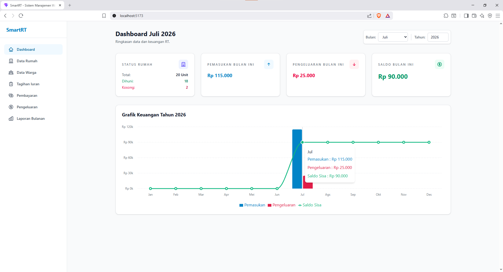
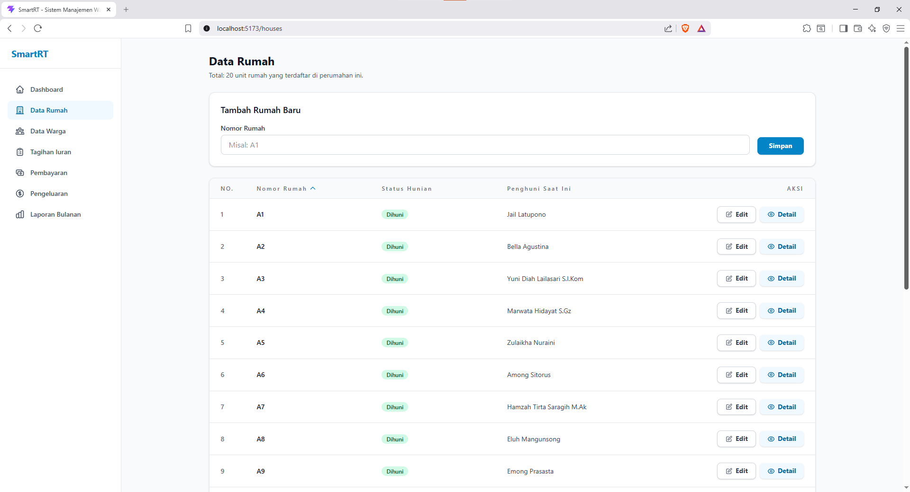
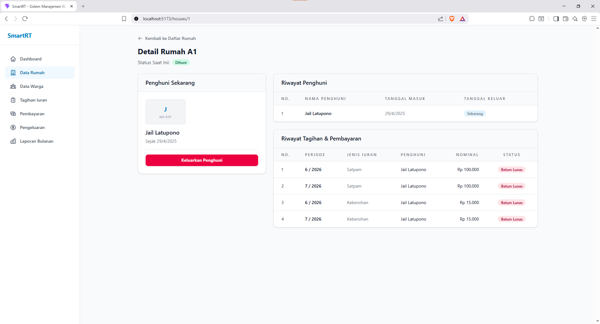
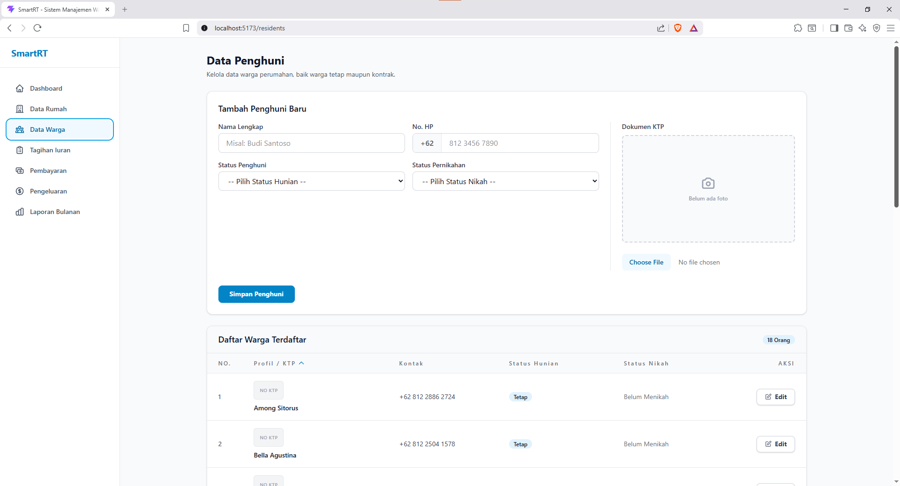
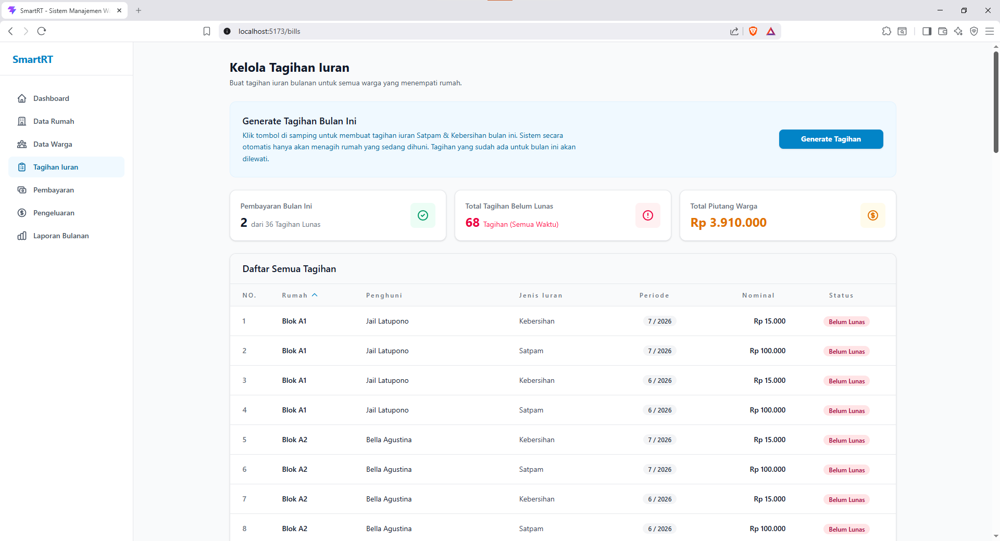
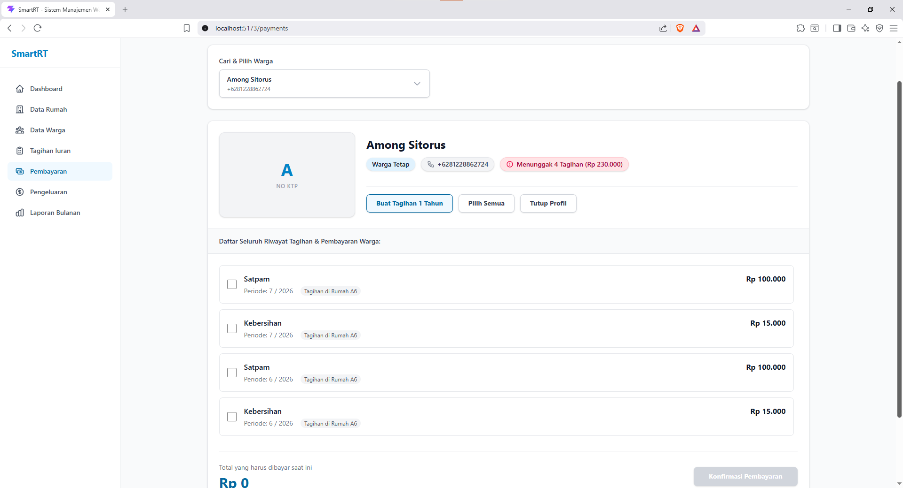
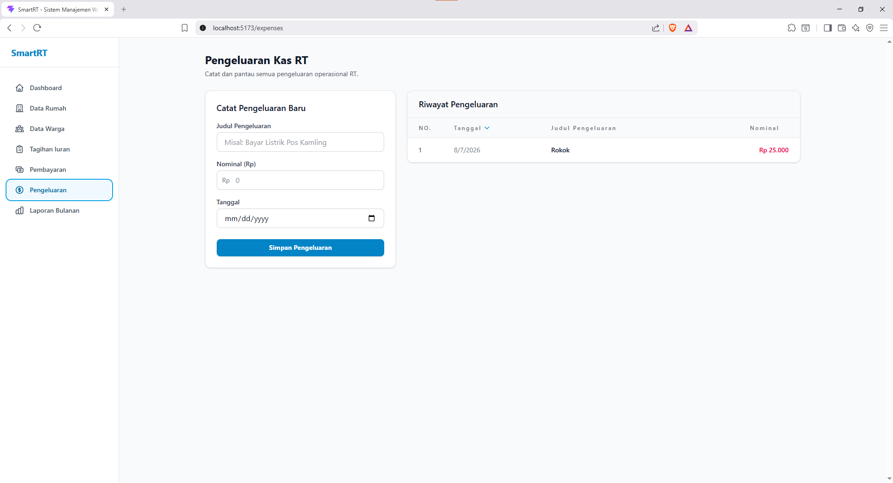
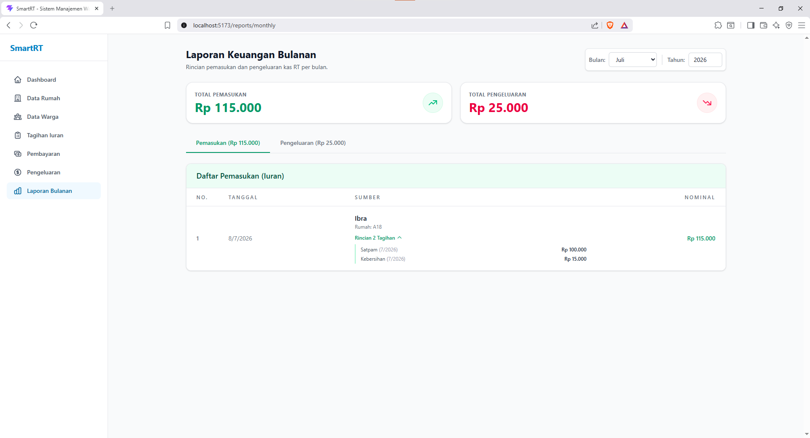
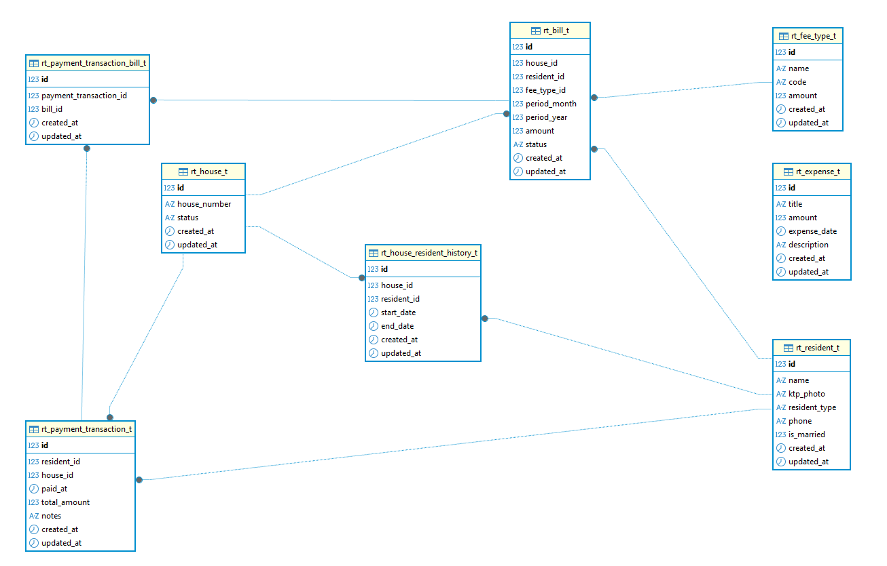

# Rangkuman Hasil Pekerjaan - Skill Fit Test

Dokumen ini memuat rangkuman fitur-fitur yang telah diselesaikan untuk memenuhi kriteria pada soal Skill Fit Test, beserta screenshot fungsionalitas aplikasinya.

---

## 1. Dashboard & Ringkasan Keuangan
Halaman utama yang menampilkan ringkasan data rumah (total unit, yang dihuni, dan kosong), keuangan bulan berjalan, serta **Grafik Keuangan selama 1 Tahun**.

## 2. Mengelola Rumah
Halaman pendataan unit rumah. Masing-masing rumah memiliki halaman detail yang menyimpan riwayat siapa saja yang pernah/sedang menghuni, serta riwayat tagihan dan pembayaran rumah tersebut.

## 3. Mengelola Penghuni
Halaman pengelolaan data warga (tetap maupun kontrak). Termasuk kelengkapan data seperti Nama Lengkap, Foto KTP, No. Telepon, dan Status Pernikahan.

## 4. Mengelola Pembayaran (Iuran)
Sistem memfasilitasi pembuatan dan pelunasan tagihan. Termasuk fitur canggih untuk mencetak sekaligus melunasi iuran warga selama 1 tahun (dibayar di muka).

## 5. Laporan Detail & Pengeluaran Bulanan
Halaman yang menampilkan laporan mendetail per bulan. Terdapat pemisahan (tab) antara Pemasukan dari iuran warga dan rincian Pengeluaran rutin maupun insidental RT.

---

## Entity Relationship Diagram (ERD)
Desain relasi tabel database untuk aplikasi SmartRT.

### Penjelasan Relasi Antar Tabel

1. **`rt_house_t` & `rt_resident_t` (Many-to-Many)**
   - **Tabel Pivot:** `rt_house_resident_history_t`
   - **Alasan:** Sebuah rumah bisa dihuni oleh banyak warga secara bergantian dari waktu ke waktu (misal: warga lama pindah, warga baru masuk kontrak). Sebaliknya, seorang warga juga bisa saja pindah dari satu unit rumah ke unit rumah lain di perumahan yang sama. Tabel pivot ini digunakan untuk melacak **riwayat** kapan seseorang mulai menetap (`start_date`) dan kapan dia keluar (`end_date`). Jika `end_date` kosong (null), artinya warga tersebut adalah penghuni aktif saat ini.

2. **`rt_payment_transaction_t` & `rt_bill_t` (Many-to-Many)**
   - **Tabel Pivot:** `rt_payment_transaction_bill_t`
   - **Alasan:** Satu kali transaksi pembayaran bisa digunakan untuk melunasi **banyak tagihan sekaligus**. Misalnya, seorang warga membayar iuran Satpam dan Kebersihan sekaligus untuk 12 bulan ke depan (total 24 tagihan dilunasi dalam 1 struk transaksi). Penggunaan *pivot table* membuat sistem sangat fleksibel dalam mencatat tagihan mana saja yang dibayar dalam satu waktu.

3. **Relasi One-to-Many Lainnya**
   - **`rt_house_t` ke `rt_bill_t`**: Satu rumah akan memiliki banyak lembar tagihan seiring berjalannya bulan.
   - **`rt_fee_type_t` ke `rt_bill_t`**: Satu jenis iuran (misal: Satpam) akan tercatat di banyak lembar tagihan milik berbagai rumah.
   - **`rt_resident_t` ke `rt_payment_transaction_t`**: Seorang warga akan melakukan banyak transaksi pembayaran selama dia tinggal di perumahan tersebut.
